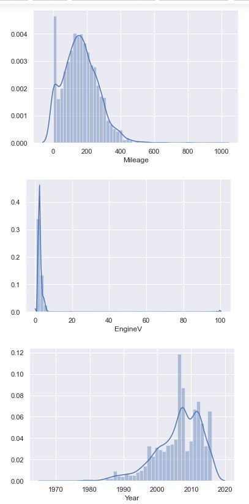
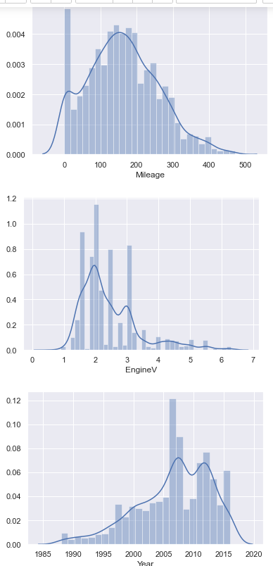
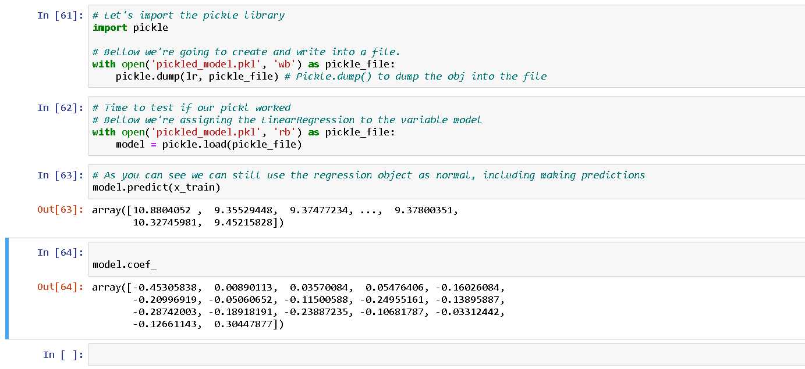

# How to Deploy Machine Learning Models - Part 1 (The Pickling)

## Project Outline

The goal is to create an easy to follow tutorial for deploying your first Machine Learning Model on AWS EC2. 

---
## Description of Data

### Size
Project size : 9.72 MB

### Source
The Source for this data was Kaggle.com
###Data Dictionary

|Feature|Type|Description|
|---|---|---|
|Brandl|object| Who manufacturers the vihicle|
|Price|int| The cost of the car in dollars |
|Year|int|The year in which the car was made |
|Body|int|The type of vihicle: sedan, van, crossover, ect.|
|Mileage|int| Number on miles on the vihicle |
|EngineV|float| The size of the engine in liters|
					Engine Type	Registration	Year	Model
Full data
---
## Data Visualization
 sure your data looks nice and normally distributed. 

Before: 

 

After: 

### Pickel Your Model

---

### Next Steps
***Next Step*** for this project will be to create a Flask App to allow users to use your model and get predictions. 
This Repo will continue to be updated until completion, follow me on medium for updates. I usually post at least once a week.

 
 
[Oliver Hernandez](https://medium.com/@oahernandez_22691)